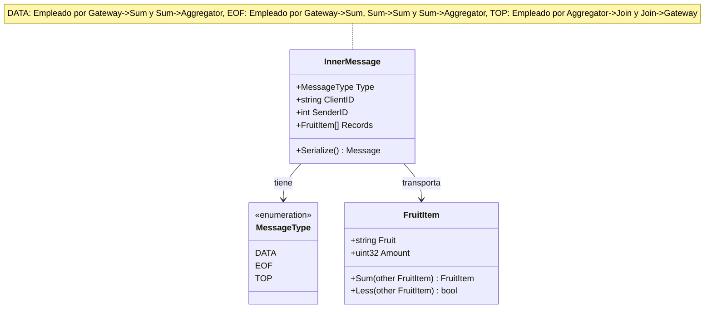
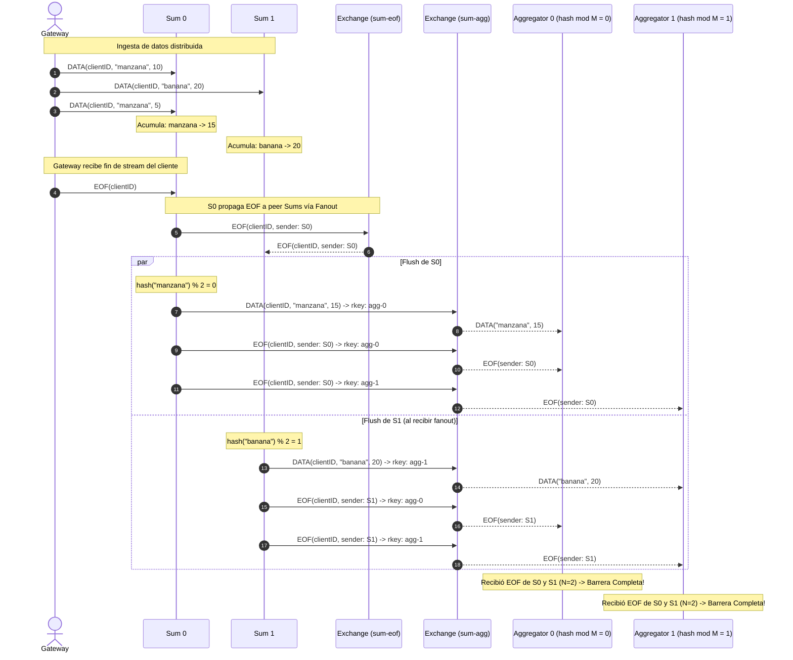
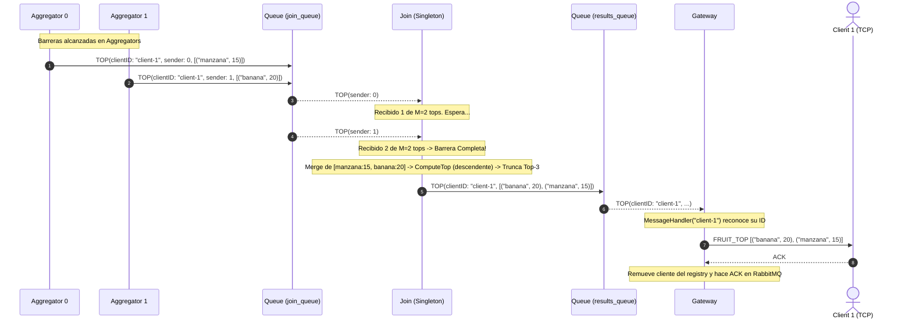
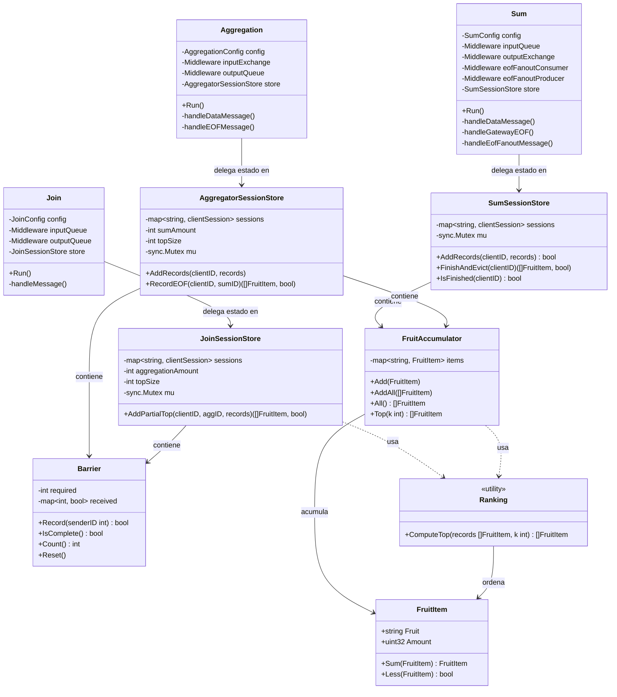
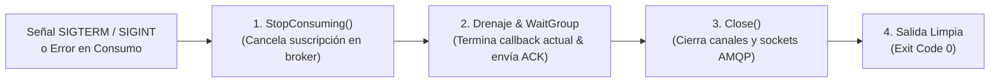

# Informe de Arquitectura y Coordinación Distribuida

## 1. Introducción y Objetivos del Sistema

El sistema implementado consiste en una topología distribuida basada en el paradigma **MapReduce (Worker-Per-Filter pipeline)** para procesar flujos masivos de pares `(fruta, cantidad)` enviados por múltiples clientes concurrentes. El objetivo final es devolver a cada cliente su ranking aislado (**Top-$K$**) de frutas con mayor volumen acumulado, garantizando:

1. **Aislamiento Entre Clientes:** Ningún flujo de datos de un cliente puede contaminar o interferir con el de otro.
2. **Escalabilidad Horizontal:** Capacidad de escalar el número de instancias de cómputo ($N$ réplicas de `Sum` y $M$ réplicas de `Aggregation`) según la carga de trabajo y el volumen de datos.
3. **Mínima Redundancia Computacional y de Red:** Evitar procesamiento duplicado de frutas mediante particionado determinístico y aplicar reducción temprana (agregación) antes de transmitir hacia el nodo consolidador (`Join`).
4. **Opacidad de Tipos:** Tratamiento de `FruitItem` como un tipo de dato opaco, operando únicamente a través de sus métodos provistos (`Sum()` y `Less()`).
5. **Encapsulamiento y Principios de Diseño:** Separación estricta entre la infraestructura de mensajería (AMQP) y los modelos de estado de dominio, encapsulando barreras, acumuladores y ciclos de vida en objetos cohesivos.

---

## 2. Protocolo de Comunicación Interno (`common/messageprotocol/inner`)

Para la comunicación asíncrona a través de RabbitMQ entre los distintos nodos (`Gateway`, `Sum`, `Aggregation`, `Join`), se definió un protocolo de mensajería unificado y tipado encapsulado en la estructura `InnerMessage`.

### 2.1 Estructura del Mensaje

```go
type MessageType string

const (
    MsgData MessageType = "DATA" // Registros de datos (fruta, cantidad)
    MsgEOF  MessageType = "EOF"  // Notificación de fin de flujo
    MsgTop  MessageType = "TOP"  // Ranking top-k calculado
)

type InnerMessage struct {
    Type     MessageType           `json:"type"`
    ClientID string                `json:"client_id"`
    SenderID int                   `json:"sender_id,omitempty"`
    Records  []fruititem.FruitItem `json:"records,omitempty"`
}
```

- **`Type`:** Discrimina el propósito del mensaje (`DATA`, `EOF`, `TOP`).
- **`ClientID`:** Identificador unívoco del cliente generado en el `MessageHandler` del `Gateway` (`client-1`, `client-2`, etc.), que acompaña al mensaje a lo largo de todo el pipeline para garantizar el aislamiento multi-cliente.
- **`SenderID`:** Identificador numérico de la réplica emisora (por ejemplo, el `ID` de la instancia `Sum` o `Aggregation`), utilizado como identificador de origen para completar las barreras de sincronización.
- **`Records`:** Colección de `FruitItem` transportados en el payload.

### 2.2 Diagrama del Protocolo y Ciclo de Vida del Mensaje



---

## 3. Coordinación entre `Sum` y `Aggregation`

El pasaje entre la etapa de `Sum` (mapeo y suma local) y `Aggregation` (agrupamiento determinístico por partición y reducción) constituye el núcleo crítico de coordinación de este sistema distribuido. A continuación se detallan las decisiones de diseño y los mecanismos de resiliencia implementados:

### 3.1 Detección y Propagación de EOF
1. **Limitación de la Cola de Entrada:** El Gateway recibe el comando `EndOfRecords` de un cliente y publica un `EOF(ClientID)` en la cola de trabajo compartida `input_queue`. Debido a la semántica de colas punto a punto de RabbitMQ (*competing consumers*), dicho mensaje es consumido por **una única réplica** de `Sum`.
2. **Intercambio Fanout (`<SUM_PREFIX>_eof`):** Para que el resto de las $N-1$ réplicas se enteren de que ese cliente ha finalizado (y puedan vaciar sus sumas parciales acumuladas en memoria), la réplica de `Sum` que recibe el EOF original realiza un broadcast inmediato hacia un exchange fanout (`<SUM_PREFIX>_eof`).
3. **Colas Dedicadas por Réplica:** Cada nodo `Sum` posee una cola con nombre propio (`<SUM_PREFIX>_eof_<ID>`) enlazada a dicho exchange fanout. Cuando una réplica recibe el EOF por el fanout:
   - Delega la verificación en su `SumSessionStore`.
   - Si no había finalizado aún a ese cliente, `FinishAndEvict()` retorna atómicamente los registros acumulados y marca al cliente como completado.
   - Si ya lo había procesado (caso de la réplica que originó el broadcast), `FinishAndEvict()` retorna `ok=false` y se descarta el mensaje, previniendo bucles o duplicación de trabajo.

### 3.2 Control de Concurrencia y Prefetch Estricto (`QoS=1`)
Un riesgo fundamental en arquitecturas con colas secundarias de señalización es la inversión de orden entre datos y control: si un nodo `Sum` recibe el EOF vía fanout mientras aún tiene paquetes de datos del cliente pendientes en su buffer local de red o de canal Go, procesar el EOF prematuramente descartaría o dejaría huérfanos esos datos. Para tratar este caso borde, se configuró un **prefetch estricto** en el middleware (`ch.Qos(1, 0, false)`) para el consumo de `input_queue`.

Esto provee una garantía determinística: Debido a que el Gateway opera de forma síncrona (esperando la confirmación de cada registro por TCP antes de enviar el siguiente) y encola el EOF estrictamente al final del stream del cliente, en el instante en que el EOF es extraído de `input_queue` por RabbitMQ, **no existe ningún registro de datos anterior de ese cliente encolado en el broker**. Al tener `QoS=1`, ningún worker tiene mensajes bufferizados en cola local. El mutex del manejador asegura que cualquier registro que se estuviera computando activamente en ese instante termine antes de atender el EOF.

### 3.3 Particionado Determinístico (`hash(fruit) mod M`)
En lugar de realizar broadcast de cada fruta a todos los Aggregators (lo que causaría $O(N \times M)$ transmisiones redundantes), cada nodo `Sum` calcula la partición destino aplicando la función hash estándar FNV-1a sobre el nombre de la fruta:

$$\text{partition} = \text{hash}(\text{fruit}) \pmod M$$

El registro se publica con la routing key `<AGGREGATION_PREFIX>_<partition>` a través del exchange topic `<AGGREGATION_PREFIX>`. Cada Aggregator $j$ consume exclusivamente de su cola nombrada `<AGGREGATION_PREFIX>_j`.

### 3.4 Barrera de Sincronización en `Aggregation`
Cada Aggregator recibe sumas parciales de distintas instancias de `Sum` para las frutas que le fueron asignadas. Por lo tanto, no puede determinar el ranking Top-K de su partición hasta asegurarse de haber recibido la totalidad de los datos de todos los `Sum`. Conciliar estos datos requirió el siguiente flujo:

1. **Broadcast de EOF hacia Aggregators:** Tras vaciar sus sumas locales para un cliente, cada nodo `Sum` emite un mensaje `EOF(ClientID, SumID)` hacia **todas** las $M$ particiones de Aggregation (`<AGGREGATION_PREFIX>_0 ... <AGGREGATION_PREFIX>_{M-1}`).
2. **Barrera de $N$ EOFs Encapsulada:** Cada Aggregator delega el seguimiento en su `AggregatorSessionStore`, que utiliza un objeto `Barrier` interno para registrar los `SumID` únicos observados. La condición de disparo de la barrera es:
   $$\text{barrier.IsComplete}() \iff \text{barrier.Count}() == N \quad (\text{SUM-AMOUNT})$$
3. **Manejo de Clientes Sparse:** Incluso si un Aggregator no recibió ninguna fruta de un cliente (porque todas se mapearon a otras particiones), al recibir los $N$ EOFs emite un mensaje `TOP` vacío (`Records: []`) hacia el nodo `Join`. Esto evita el estancamiento de la barrera en Join.
4. **Orden FIFO Estricto:** Dado que tanto los mensajes de datos como el EOF emitidos por un `Sum` viajan por el mismo canal y cola de RabbitMQ hacia un Aggregator específico, la especificación AMQP 0-9-1 garantiza que los datos siempre son entregados y procesados antes que el EOF de ese mismo `Sum`.

### 3.5 Diagrama de Secuencia: Coordinación Sum $\to$ Aggregation



---

## 4. Coordinación entre `Aggregation` y `Join`

Una vez superada la barrera en los Aggregators, se genera la consolidación final hacia el nodo `Join`.

### 4.1 Reducción Temprana

Si un dataset cuenta con miles de frutas distintas asignadas a un Aggregator, transmitir la totalidad de las sumas parciales saturaría la red y trasladaría una carga excesiva al nodo `Join`, el cual (por restricciones de consigna), es único. Para conciliar los tops parciales y el top global, se tuvo en cuenta la siguiente propiedad matemática: *Si un ítem no forma parte del Top-$K$ de su propia partición disjunta, es imposible que pertenezca al Top-$K$ global del cliente*.

Por tanto, al completarse la barrera, el `AggregatorSessionStore` delega en el acumulador y la función de dominio `ComputeTop`, ordenando las frutas locales de manera descendente según `FruitItem.Less()`:

$$\text{finalTopSize} = \min(K, \text{len}(\text{fruitItems}))$$

y envía únicamente a lo sumo $K$ elementos empaquetados en un único mensaje `TOP`.

### 4.2 Barrera de Sincronización en `Join`

El nodo `Join` (instancia única) consume de la cola `join_queue`, delegando la recolección y la barrera en su `JoinSessionStore`. El flujo de ejecución se puede resumir como:

1. **Recepción de Tops Parciales:** Por cada mensaje `TOP` recibido, el store incorpora los registros al buffer del cliente y registra al emisor en su `Barrier` interna (`aggID`).
2. **Condición de Disparo:** La consolidación global para un cliente se ejecuta atómicamente cuando se reciben los tops parciales de **todos los $M$ Aggregators**:
   $$\text{barrier.IsComplete}() \iff \text{barrier.Count}() == M \quad (\text{AGGREGATION-AMOUNT})$$
3. **Consolidación y Egress:** Se fusionan los $M$ tops parciales (un conjunto acotado de a lo sumo $M \times K$ ítems), se reordenan de forma descendente mediante `ComputeTop`, se trunca al tamaño $K$ final y se publica el `TOP` global resultante en `results_queue`.
4. **Entrega al Cliente en Gateway:** El `Gateway` lee de `results_queue`. En su `handleClientResponse`, itera sobre las conexiones activas invocando `DeserializeResultMessage()`. Únicamente el `MessageHandler` cuyo `clientID` coincida procesará el mensaje, lo escribirá al socket TCP del cliente correspondiente y enviará el ACK a RabbitMQ.

### 4.3 Diagrama de Secuencia: Coordinación Aggregation $\to$ Join $\to$ Gateway



---

## 5. Análisis Comparativo de la Clave de Particionado: `fruit` vs `client_id`

Al diseñar el particionado entre los nodos `Sum` y `Aggregation`, surgió la disyuntiva de qué atributo utilizar como clave de ruteo: `hash(fruit)` o `hash(client_id)`.

| Criterio | Particionado por `fruit` (Diseño Implementado) | Particionado por `client_id` (Alternativa) |
| :--- | :--- | :--- |
| **Escalabilidad ante grandes volúmenes de datos por cliente** | **Muy bueno:** Si un solo cliente envía 10 GB de datos con gran variedad de frutas, el volumen y cómputo de sumas se balancea equitativamente entre los $M$ Aggregators. | **Pésima (Cuello de botella):** Todo el volumen de datos del cliente recae sobre un único Aggregator. Los restantes $M-1$ Aggregators permanecen ociosos para ese cliente. |
| **Aprovechamiento de réplicas con pocos clientes** | **Óptimo:** Incluso con 1 solo cliente (Escenario 1), todos los $M$ Aggregators trabajan en paralelo procesando subconjuntos de frutas. | **Nulo:** Si hay 1 cliente y 10 Aggregators, 9 instancias estarán al 0% de uso. |
| **Redundancia de cómputo** | **Cero:** Cada fruta es procesada y acumulada en una única instancia de Aggregation. | **Cero:** Cada cliente es procesado por un único Aggregator. |
| **Tráfico hacia el nodo `Join`** | **O(MxK):** Cada Aggregator envía a lo sumo su Top-K parcial. | **O(K):** El único Aggregator asignado al cliente calcula el Top final y lo envía directo. |
| **Complejidad de Coordinación** | **Mayor (Requiere barrera):** Cada Aggregator debe esperar los $N$ EOFs de todos los Sum workers antes de resolver su Top parcial. | **Baja:** El Aggregator solo necesita esperar que termine ese cliente, sin cruces entre múltiples particiones. |

### Justificación de la Elección de `fruit`

El requerimiento central del sistema establece la capacidad de procesar **grandes volúmenes de datos transmitidos desde los clientes** sin generar cuellos de botella mononodo. 

Particionar por `client_id` resolvería trivialmente la coordinación, pero violaría el principio fundamental de MapReduce: el paralelismo a nivel de datos. Bajo `client_id`, la capacidad máxima de procesamiento de un flujo estaría limitada por los recursos de una sola máquina. En cambio, con `hash(fruit)`, un dataset arbitrariamente grande de un único cliente se descompone y procesa concurrentemente a través de todas las réplicas del cluster, garantizando alta disponibilidad y rendimiento horizontal.

---

## 6. Escalabilidad del Sistema y Gestión de Recursos

El diseño implementado garantiza la escalabilidad en tres dimensiones:

### 6.1 Clientes Concurrentes
- El Gateway no bloquea el procesamiento: asigna un `clientID` secuencial protegido atómicamente a cada conexión TCP entrante y despacha los datos a la cola compartida.
- En `Sum`, `Aggregation` y `Join`, los estados internos se gestionan de forma completamente aislada por sesión de cliente a través de sus respectivos `SessionStore`.
- Las consultas de múltiples clientes fluyen en paralelo a través del mismo pipeline sin posibilidad de contaminación cruzada.

### 6.2 Grandes Volúmenes de Datos
- **Control de Memoria y Desalojo Atómico:** Los `SessionStore` liberan explícitamente los estados en memoria inmediatamente después de que se satisface la barrera y se envían los resultados downstream (`FinishAndEvict`, `RecordEOF`, `AddPartialTop`). Esto asegura una huella de memoria ínfima en el largo plazo respecto a la cantidad acumulada de clientes históricos.
- **Acotación de Flujo hacia Join:** Gracias a la reducción temprana en Aggregation, el nodo `Join` recibe a lo sumo $M \times K$ pares `(fruta, cantidad)` por cliente, haciendo que el consumo de red y tiempo de ordenamiento global en Join sea despreciable e independiente del tamaño del archivo de entrada.

### 6.3 Cantidad de Controles y Resiliencia Topológica
- **Nombres Determinísticos de Colas:** Al evitar colas anónimas o efímeras y utilizar colas nombradas (`<PREFIX>_<ID>`), el sistema tolera desfases temporales en el arranque de contenedores (e.g. `Sum` puede comenzar a emitir hacia la cola de `Aggregation` incluso si el proceso de `Aggregation` aún está iniciando, sin perder mensajes).
- **Invariancia ante Renombramientos:** la arquitectura se configura dinámicamente a través de las variables de entorno (`SUM_AMOUNT`, `SUM_PREFIX`, `AGGREGATION_AMOUNT`, `AGGREGATION_PREFIX`), funcionando sin requerir servicio de descubrimiento en tiempo de ejecución.

---

## 7. Arquitectura de Software y Encapsulamiento POO

Con el objetivo de optimizar la mantenibilidad, robustez y testeabilidad del código, se realizó una refactorización aplicando POO. Se reemplazaron las estructuras anémicas y mapas anidados en los nodos por abstracciones de dominio y sesiones con encapsulamiento estricto.

### 7.1 Primitivas de Dominio (`common/coordination`)

Se creó el paquete `common/coordination` que define tipos de datos abstractos independientes de la infraestructura:

1. **`Barrier` (`barrier.go`):**
   * Encapsula la sincronización M-de-N para señales de finalización.
   * Lleva el control de identificadores de emisor únicos (`Record(senderID int) bool`), deduplicando transmisiones redundantes.
   * Expone métodos de consulta claros (`IsComplete() bool`, `Count() int`, `Reset()`).
   * Reutilizado tanto en `Aggregation` ($N$ Sum workers) como en `Join` ($M$ Aggregator workers).

2. **`FruitAccumulator` (`accumulator.go`):**
   * Encapsula la acumulación de totales por fruta (`map[string]FruitItem`).
   * Trata a `FruitItem` como un tipo opaco, invocando exclusivamente `FruitItem.Sum()`.
   * Provee métodos de alto nivel: `Add()`, `AddAll()`, `Get()`, `All()` y `Top(k)`.

3. **`Ranking` (`ranking.go`):**
   * Provee la función pura de dominio `ComputeTop(records []FruitItem, k int) []FruitItem`.
   * Realiza un ordenamiento descendente utilizando la primitiva de comparación provista `FruitItem.Less()`.
   * Centraliza la lógica de selección de ranking, eliminando la duplicación de código entre `Aggregation` y `Join`.

### 7.2 Gestores de Sesión por Nodo (`SessionStore`)

En cada nodo del pipeline se desacopló el middleware de transporte del estado interno mediante sesiones dedicadas:

* **`SumSessionStore` (`sum/sum/store.go`):**
  * Administra el ciclo de vida de ingesta de cada cliente (`clientSession`).
  * `AddRecords(clientID, records)`: Incorpora registros si el cliente está activo; rechaza escrituras si ya fue finalizado.
  * `FinishAndEvict(clientID)`: Operación que marca al cliente como finalizado, extrae los acumulados para el flush y resetea el acumulador para liberar memoria inmediatamente. Previene race conditions entre el EOF recibido del Gateway y el EOF replicado vía fanout exchange.

* **`AggregatorSessionStore` (`aggregation/aggregation/store.go`):**
  * Asocia a cada cliente un `FruitAccumulator` y un `Barrier` de $N$ Sums.
  * `AddRecords(clientID, records)`: Incorpora las sumas parciales recibidas de los `Sum`.
  * `RecordEOF(clientID, sumID)`: Registra el EOF del worker. Cuando la barrera se completa, computa automáticamente el Top-K parcial (`Top(k)`) y desaloja la sesión de memoria (`delete(sessions, clientID)`), retornando los registros calculados listos para emisión.

* **`JoinSessionStore` (`join/join/store.go`):**
  * Asocia a cada cliente un buffer consolidado de registros y un `Barrier` de $M$ Aggregators.
  * `AddPartialTop(clientID, aggID, records)`: Acumula los tops parciales. Al completarse la barrera de todos los Aggregators, ejecuta `ComputeTop()`, desaloja la sesión y retorna el Top-K global final.

### 7.3 Diagrama de Clases: Separación entre Orquestación y Dominio



---

## 8. Manejo de SIGTERM/SIGINT y Errores de Consumo

### 8.1 Contexto y Motivación

En la arquitectura base provista por el esqueleto, la captura de señales del sistema operativo estaba confinada exclusivamente al `Client` y al `Gateway`, dejando a los nodos de cómputo interno (`Sum`, `Aggregation` y `Join`) sin control explícito sobre su ciclo de vida. Al recibir una orden de detención (e.g. `docker compose stop -t 5` o `SIGTERM` emitido por el orquestador), estos procesos —que ejecutan como PID 1 dentro de sus respectivos contenedores— eran interrumpidos de manera inmediata por el manejador por defecto del runtime de Go. Esto desembocaba en:

- Ruptura abrupta de los sockets TCP con RabbitMQ sin usar los handshakes de cierre AMQP (`channel.close` / `connection.close`).
- Riesgo de abortar procesamientos activos en memoria a mitad de camino, dejando mensajes entregados sin confirmar (`ACK`) o sesiones a medio persistir.
- Dependencia de timeouts externos forzados (`SIGKILL`) si alguna rutina quedaba bloqueada.

### 8.2 Protocolo de Graceful Shutdown

Para resolver esta falencia, se implementó en `Sum`, `Aggregation` y `Join` un protocolo de terminación limpia y determinística compuesto por cuatro fases:



El flujo, más detallado, se define a continuación:

1. **Captura No Bloqueante de Señales:** Cada nodo registra un canal de notificación con `os/signal` (`signal.Notify`) para interceptar tanto `syscall.SIGTERM` (utilizada por Docker) como `syscall.SIGINT` (Ctrl+C). El bucle principal de `Run()` se coordina mediante una sentencia `select` no bloqueante para el consumo.
2. **Desuscripción en el Broker (`StopConsuming`):** Al detectar la señal, el nodo invoca `StopConsuming()` sobre sus colas y exchanges de entrada, garantizando que el broker **no despache ningún mensaje nuevo** a la réplica en proceso de apagado.
3. **Despacho de Tareas en Vuelo:** Las goroutines que ejecutan `StartConsuming` están orquestadas bajo un `sync.WaitGroup`. Al cerrarse el canal de entregas de Go tras la desuscripción, se permite que la última entrega en procesamiento culmine su cómputo de dominio, libere los locks de exclusión mutua correspondientes (`sum.mu`) y envíe exitosamente el `ack()` al broker antes de ejecutar `wg.Done()`.
4. **Cierre de Conexiones AMQP e Idempotencia (`Stop` con `sync.Once`):** Una vez que el `WaitGroup` certifica que ninguna goroutine continúa utilizando la infraestructura de transporte, se invocan secuencialmente los métodos `Close()` de todos los middlewares asociados (tanto de entrada como de salida y fanout). La ejecución de `Stop()` está encapsulada mediante `sync.Once`, previniendo condiciones de carrera ante señales repetidas o invocaciones concurrentes.

### 8.3 Manejo de Errores de Consumo

Además de las señales de terminación externas, los nodos deben responder adecuadamente ante anomalías en el transporte (por ejemplo, desconexión repentina de RabbitMQ o fallas irrecuperables en el canal).

Para contemplar este escenario:
- Cada goroutine de consumo supervisa el valor retornado por `StartConsuming()`.
- Si el consumo finaliza de manera imprevista con error (`err != nil`), este se transmite a través de un canal interno tipado (`consumeErr`).
- El `select` en `Run()` despierta de inmediato ante `case err := <-consumeErr:`, registrando el incidente vía `slog.Error` y disparando la misma rutina `Stop()`. Esto evita que el nodo quede en estado "zombi" (con el proceso vivo pero sin consumir) y permite una salida limpia para que el orquestador pueda actuar.
