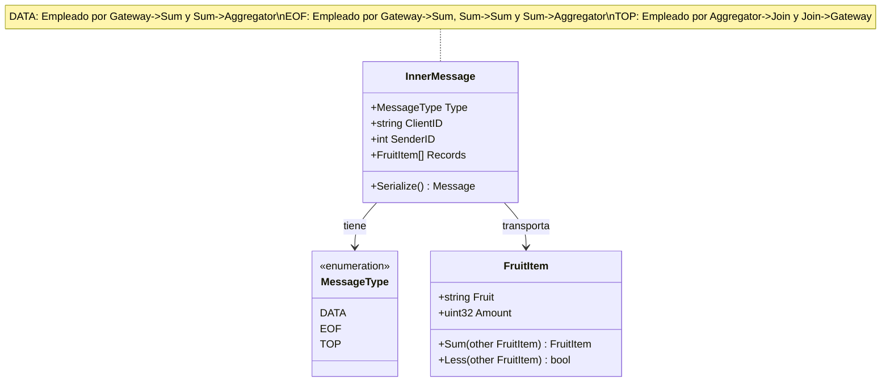

# Informe de Arquitectura y Coordinación Distribuida

## 1. Introducción y Objetivos del Sistema

El sistema implementado consiste en una topología distribuida basada en el paradigma **MapReduce (Worker-Per-Filter pipeline)** para procesar flujos masivos de pares `(fruta, cantidad)` enviados por múltiples clientes concurrentes. El objetivo final es devolver a cada cliente su ranking aislado (**Top-$K$**) de frutas con mayor volumen acumulado, garantizando:

1. **Aislamiento Entre Clientes:** Ningún flujo de datos de un cliente puede contaminar o interferir con el de otro.
2. **Escalabilidad Horizontal:** Capacidad de escalar el número de instancias de cómputo ($N$ réplicas de `Sum` y $M$ réplicas de `Aggregation`) según la carga de trabajo y el volumen de datos.
3. **Mínima Redundancia Computacional y de Red:** Evitar procesamiento duplicado de frutas mediante particionado determinístico y aplicar reducción temprana (agregación) antes de transmitir hacia el nodo consolidador (`Join`).
4. **Opacidad de Tipos:** Tratamiento de `FruitItem` como un tipo de dato opaco, operando únicamente a través de sus métodos provistos (`Sum()` y `Less()`).

---

## 2. Protocolo de Comunicación Interno (`common/messageprotocol/inner`)

Para la comunicación asíncrona a través de RabbitMQ entre los distintos nodos (`Gateway`, `Sum`, `Aggregation`, `Join`), se definió un protocolo de mensajería unificado y tipado encapsulado en la estructura `InnerMessage`.

### 2.1 Estructura del Mensaje

```go
type MessageType string

const (
    MsgData MessageType = "DATA" // Registros de datos (fruta, cantidad)
    MsgEOF  MessageType = "EOF"  // Notificación de fin de flujo
    MsgTop  MessageType = "TOP"  // Ranking top-k calculado
)

type InnerMessage struct {
    Type     MessageType           `json:"type"`
    ClientID string                `json:"client_id"`
    SenderID int                   `json:"sender_id,omitempty"`
    Records  []fruititem.FruitItem `json:"records,omitempty"`
}
```

- **`Type`:** Discrimina el propósito del mensaje (`DATA`, `EOF`, `TOP`).
- **`ClientID`:** Identificador unívoco del cliente generado en el `MessageHandler` del `Gateway` (`client-1`, `client-2`, etc.), que acompaña al mensaje a lo largo de todo el pipeline para garantizar el aislamiento multi-cliente.
- **`SenderID`:** Identificador numérico de la réplica emisora (por ejemplo, el `ID` de la instancia `Sum` o `Aggregation`), utilizado como identificador de origen para completar las barreras de sincronización.
- **`Records`:** Colección de `FruitItem` transportados en el payload.

### 2.2 Diagrama del Protocolo y Ciclo de Vida del Mensaje



---

## 3. Coordinación entre `Sum` y `Aggregation`

Desde mi perspectiva, el pasaje entre la etapa de `Sum` (mapeo y suma parcial) y `Aggregation` (agrupamiento y reducción) constituye el núcleo crítico de coordinación de este sistema distribuido. A continuación se detalla las decisiones diseño y un riesgo fundamental que se encontró:

### 3.1 Detección y Propagación de EOF

1. **Limitación de la Cola de Entrada:** El Gateway recibe el comando `EndOfRecords` de un cliente y publica un `EOF(ClientID)` en la cola de trabajo compartida `input_queue`. Debido a la semántica de colas punto a punto de RabbitMQ (*competing consumers*), dicho mensaje es consumido por **una sola única réplica** de `Sum`.
2. **Intercambio Fanout (`<SUM_PREFIX>_eof`):** Para que el resto de las $N-1$ réplicas se enteren de que ese cliente ha finalizado (y puedan vaciar sus sumas parciales acumuladas en memoria), la réplica de `Sum` que recibe el EOF original realiza un broadcast inmediato hacia un exchange fanout (`<SUM_PREFIX>_eof`).
3. **Colas Dedicadas por Réplica:** Cada nodo `Sum` posee una cola con nombre propio (`<SUM_PREFIX>_eof_<ID>`) enlazada a dicho exchange fanout. Cuando una réplica recibe el EOF por el fanout:
   - Adquiere su mutex local de sincronización.
   - Si no había finalizado aún a ese cliente, vuelca sus sumas locales, envía sus EOFs a los Aggregators y marca el cliente como completado.
   - Si ya lo había procesado (caso de la réplica que originó el broadcast), descarta el mensaje, previniendo bucles o duplicación de trabajo.

### 3.2 Control de Concurrencia y Prefetch Estricto (`QoS=1`)

Un riesgo fundamental que se encontró en la arquitectura propuesta (con colas secundarias de señalización) es la inversión de orden entre datos y control: si un nodo `Sum` recibe el EOF vía fanout mientras aún tiene paquetes de datos del cliente pendientes en su buffer local de red o de canal Go, procesar el EOF prematuramente descartaría o dejaría huérfanos esos datos. Para tratar este caso borde, se configuró un **prefetch estricto** en el middleware (`ch.Qos(1, 0, false)`) para el consumo de `input_queue`.

Esto provee una garantía determinística: Debido a que el Gateway opera de forma síncrona (esperando la confirmación de cada registro por TCP antes de enviar el siguiente) y encola el EOF estrictamente al final del stream del cliente, en el instante en que el EOF es extraído de `input_queue` por RabbitMQ, **no existe ningún registro de datos anterior de ese cliente encolado en el broker**. Al tener `QoS=1`, ningún worker tiene mensajes bufferizados en cola local. El mutex del manejador asegura que cualquier registro que se estuviera computando activamente en ese milisegundo termine antes de atender el EOF.

### 3.3 Particionado Determinístico (`hash(fruit) mod M`)

En lugar de realizar broadcast de cada fruta a todos los Aggregators (lo que causaría $O(N \times M)$ transmisiones redundantes), cada nodo `Sum` calcula la partición destino aplicando la función hash estándar FNV-1a sobre el nombre de la fruta:

$$\text{partition} = \text{hash}(\text{fruit}) \pmod M$$

El registro se publica con la routing key `<AGGREGATION_PREFIX>_<partition>` a través del exchange topic `<AGGREGATION_PREFIX>`. Cada Aggregator $j$ consume exclusivamente de su cola nombrada `<AGGREGATION_PREFIX>_j`.

### 3.4 Barrera de Sincronización en `Aggregation`

Cada Aggregator recibe sumas parciales de distintas instancias de `Sum` para las frutas que le fueron asignadas. Por lo tanto, no puede determinar el ranking Top-$K$ de su partición hasta asegurarse de haber recibido la totalidad de los datos de todos los `Sum`. Conciliar estos datos requirió el siguiente flujo:

1. **Broadcast de EOF hacia Aggregators:** Tras vaciar sus sumas locales para un cliente, cada nodo `Sum` emite un mensaje `EOF(ClientID, SumID)` hacia **todas** las $M$ particiones de Aggregation (`<AGGREGATION_PREFIX>_0 ... <AGGREGATION_PREFIX>_{M-1}`).
2. **Barrera de $N$ EOFs:** Cada Aggregator mantiene un registro `eofsReceived[clientID][sumID]`. La condición de disparo de la barrera es:
   $$\text{len}(\text{eofsReceived}[\text{clientID}]) == N \quad (\text{SUM\_AMOUNT})$$
3. **Manejo de Clientes Sparse:** Incluso si un Aggregator no recibió ninguna fruta de un cliente (porque todas se mapearon a otras particiones), al recibir los $N$ EOFs emite un mensaje `TOP` vacío (`Records: []`) hacia el nodo `Join`. Esto evita el estancamiento de la barrera en Join.
4. **Orden FIFO Estricto:** Dado que tanto los mensajes de datos como el EOF emitidos por un `Sum` viajan por el mismo canal y cola de RabbitMQ hacia un Aggregator específico, la especificación AMQP 0-9-1 garantiza que los datos siempre son entregados y procesados antes que el EOF de ese mismo `Sum`.

