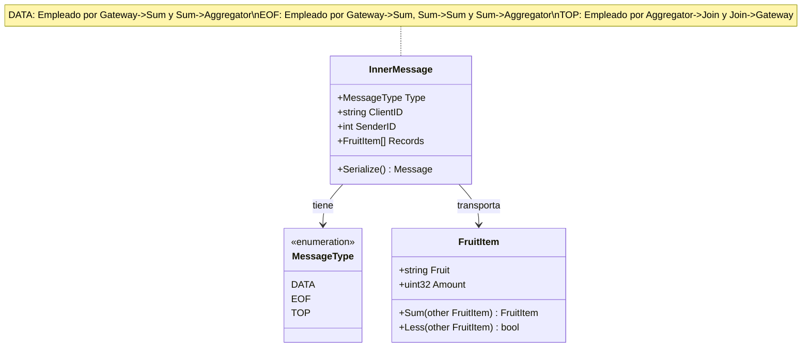

# Informe de Arquitectura y Coordinación Distribuida

## 1. Introducción y Objetivos del Sistema

El sistema implementado consiste en una topología distribuida basada en el paradigma **MapReduce (Worker-Per-Filter pipeline)** para procesar flujos masivos de pares `(fruta, cantidad)` enviados por múltiples clientes concurrentes. El objetivo final es devolver a cada cliente su ranking aislado (**Top-$K$**) de frutas con mayor volumen acumulado, garantizando:

1. **Aislamiento Entre Clientes:** Ningún flujo de datos de un cliente puede contaminar o interferir con el de otro.
2. **Escalabilidad Horizontal:** Capacidad de escalar el número de instancias de cómputo ($N$ réplicas de `Sum` y $M$ réplicas de `Aggregation`) según la carga de trabajo y el volumen de datos.
3. **Mínima Redundancia Computacional y de Red:** Evitar procesamiento duplicado de frutas mediante particionado determinístico y aplicar reducción temprana (agregación) antes de transmitir hacia el nodo consolidador (`Join`).
4. **Opacidad de Tipos:** Tratamiento de `FruitItem` como un tipo de dato opaco, operando únicamente a través de sus métodos provistos (`Sum()` y `Less()`).

---

## 2. Protocolo de Comunicación Interno (`common/messageprotocol/inner`)

Para la comunicación asíncrona a través de RabbitMQ entre los distintos nodos (`Gateway`, `Sum`, `Aggregation`, `Join`), se definió un protocolo de mensajería unificado y tipado encapsulado en la estructura `InnerMessage`.

### 2.1 Estructura del Mensaje

```go
type MessageType string

const (
    MsgData MessageType = "DATA" // Registros de datos (fruta, cantidad)
    MsgEOF  MessageType = "EOF"  // Notificación de fin de flujo
    MsgTop  MessageType = "TOP"  // Ranking top-k calculado
)

type InnerMessage struct {
    Type     MessageType           `json:"type"`
    ClientID string                `json:"client_id"`
    SenderID int                   `json:"sender_id,omitempty"`
    Records  []fruititem.FruitItem `json:"records,omitempty"`
}
```

- **`Type`:** Discrimina el propósito del mensaje (`DATA`, `EOF`, `TOP`).
- **`ClientID`:** Identificador unívoco del cliente generado en el `MessageHandler` del `Gateway` (`client-1`, `client-2`, etc.), que acompaña al mensaje a lo largo de todo el pipeline para garantizar el aislamiento multi-cliente.
- **`SenderID`:** Identificador numérico de la réplica emisora (por ejemplo, el `ID` de la instancia `Sum` o `Aggregation`), utilizado como identificador de origen para completar las barreras de sincronización.
- **`Records`:** Colección de `FruitItem` transportados en el payload.

### 2.2 Diagrama del Protocolo y Ciclo de Vida del Mensaje



